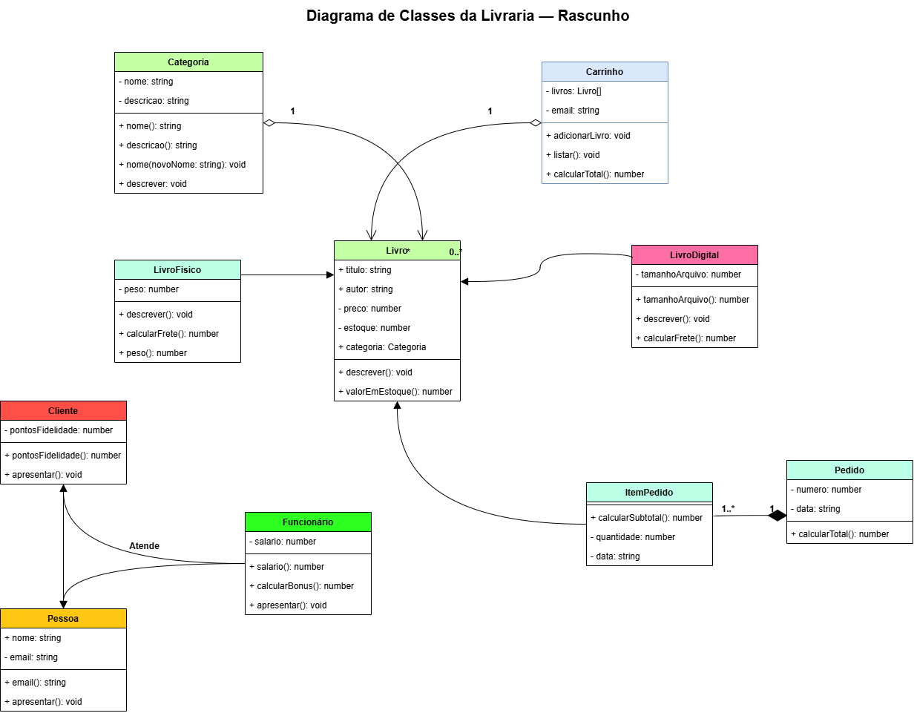

# livraria-api-grupo2

**API de Gestão da Livraria — PBE 2026**  
API de Gestão da Livraria — Grupo 2

Projeto da UC de Programação Back-End — Curso Técnico em Desenvolvimento de Sistemas  
Escola SENAI "Santo Paschoal Crepaldi" — Turma 1-2026-SESI_DEV_OC_1

---

## 👥 Integrantes

* **Ana Júlia Del Passo** — [@anapasso-spec](https://github.com/anapasso-spec)
* **Cauã Gabriel** — [@cauagabriel-dev](https://github.com/cauagabriel-dev)
* **Laura Semensato** — [@laurasemensato](https://github.com/laurasemensato)
* **Yago Henrique** — [@yagomx25](https://github.com/yagomx25)

---

## 📌 Divisão de Responsabilidades

| Bloco | Integrante | O que ficou sob responsabilidade dele(a) |
| :--- | :--- | :--- |
| **Bloco 1** | Ana Júlia | Modelagem e estruturação dos Models (`Pessoa`, `Cliente`, `Funcionario`) |
| **Bloco 1** | Cauã | Implementar os modelos de produtos (`Livro`, `LivroFisico`, `LivroDigital`) |
| **Bloco 1** | Laura Semensato | Regras de negócio do carrinho de compras e categorias (`Carrinho`, `Categoria`) |
| **Bloco 1** | Yago | Configuração das rotas, controllers e a parte de teste (`index.js`, `testar.js`) |

> *Esta tabela é atualizada a cada bloco, com rodízio de responsabilidades entre os integrantes do grupo.*

---

## 📐 Diagrama de Classes (UML)



---

## 🛠️ Tecnologias

* **Node.js** — Ambiente de execução JavaScript no servidor
* **npm** — Gerenciador de pacotes
* **JavaScript (ES6+)** — Orientação a Objetos e lógica do sistema
* **Git & GitHub** — Versionamento e trabalho em equipe no repositório

---

## 📁 Estrutura do Projeto

```text
livraria-api-grupo2/
├── docs/                  # Documentação e materiais complementares
├── src/                   # Código-fonte principal da aplicação
│   ├── controllers/       # Gerenciamento de requisições e respostas
│   ├── models/            # Classes e modelos de dados (POO)
│   │   ├── Carrinho.js
│   │   ├── Categoria.js
│   │   ├── Cliente.js
│   │   ├── Funcionario.js
│   │   ├── Livro.js
│   │   ├── LivroDigital.js
│   │   ├── LivroFisico.js
│   │   └── Pessoa.js
│   ├── routes/            # Definição dos endpoints e rotas da API
│   ├── services/          # Regras de negócio e serviços da aplicação
│   └── index.js           # Ponto de entrada da aplicação
├── .gitignore             # Arquivos e pastas ignorados pelo Git
├── package.json           # Configurações do projeto e dependências
├── package-lock.json      # Mapeamento exato de versões das dependências
├── testar.js              # Script para testes locais e validação
└── README.md              # Documentação principal do projeto